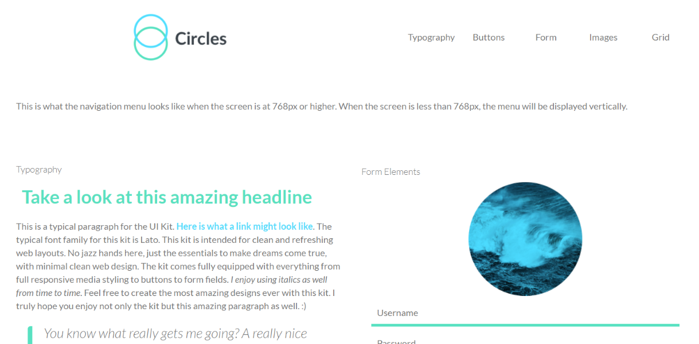

<h1>Project 4 in Techdegree. Treehouse SASS</h1>
 
<pIn this project, I converted the CSS into Sass by splitting the code into several Sass partial files. I looked for the repeated values (length units, colors, etc.) throughout the CSS and store them in Sass variables.

 
<h2>Live Demo</h2>

 
<h3>Skills</h3>
<ul>
  <li>HTML Input Types</li>
  <li>CSS</li>
  <li>SASS</li>
  <li>Testing and debugging</li>
  <li>Prepros</li>
  
</ul>
 
<h3>Conclusion</h3>

After completing the project, I have the skills of Sass micro-framework to quickly prototype other websites and build a "mobile-first" approach. This project makes me realized that SASS help the developer to code CSS in an efficient and smarter way. SASS also help the developer to organize the CSS while building bigger project
.
